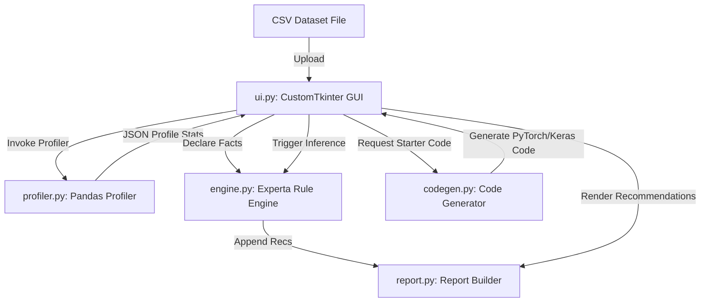

# System Architecture

The Neural Network Design Expert System is designed as a modular, rule-based desktop application. It integrates a CustomTkinter GUI, a vectorized pandas data profiler, a declarative rules-based inference engine, and a lookup-driven code generator.

---

## 🏛️ High-Level Component Layout



1. **Launcher (`main.py`)**: The main entry point that instantiates `NeuralNetworkExpertApp` and starts the Tkinter main loop.
2. **User Interface (`ui.py` & `constants.py`)**: A multi-tab dark-mode Tkinter GUI that collects inputs (variables), triggers the profiler and inference engine, displays recommendations, and allows copying of report outputs and generated code.
3. **Data Profiler (`profiler.py`)**: Reads a CSV file, profiles metrics, and outputs a structured statistics dict to populate UI variables.
4. **Knowledge Engine (`engine.py` & `facts.py`)**: Defines structured Facts and uses `experta` to perform forward-chaining reasoning via decorator-based rules.
5. **Report Builder (`report.py`)**: Accumulates text-based rules recommendations dynamically into structured categories.
6. **Code Generator (`codegen.py`)**: Takes configuration parameters and produces functional PyTorch or Keras starter scripts.

---

## 🚫 The "No-Control-Flow" Paradigm

A defining feature of this project is a strict constraint: **no conditional branches or iterative loops (`if`, `elif`, `else`, `for`, `while`, `match`, `case`) are permitted anywhere in the Python files.**

Below is an explanation of the design patterns used to replace standard control flow structures:

### 1. Declarative Forward-Chaining (Replacing `if/elif/else` logic trees)
Normally, an expert system decision tree is a complex nest of conditionals. Here, all logic is handled by **Experta Rules** matching against facts.
* **Standard Way (Forbidden):**
  ```python
  if target_kind == "continuous":
      report.add_problem("Regression task")
  elif target_kind == "binary":
      report.add_problem("Binary classification")
  ```
* **No-Control-Flow Way:**
  ```python
  @Rule(ProblemFact(target_kind="continuous"))
  def problem_regression(self):
      self.report.add_problem("Detected a regression task...")

  @Rule(ProblemFact(target_kind="binary"))
  def problem_binary(self):
      self.report.add_problem("Detected a binary classification task.")
  ```
The inference engine matches loaded facts and fires the correct handlers automatically.

### 2. Dictionary-Based Dispatch (Replacing conditional branches)
For routing variables or selecting actions, lookup tables map keys directly to configurations, outputs, or functions.
* **Standard Way (Forbidden):**
  ```python
  if framework == "pytorch":
      return generate_pytorch(params)
  else:
      return generate_keras(params)
  ```
* **No-Control-Flow Way:**
  ```python
  GENERATORS = {
      "pytorch": generate_pytorch_script,
      "keras"  : generate_keras_script,
  }
  
  def generate_code(framework: str, params: dict) -> str:
      return GENERATORS[framework](params)
  ```

### 3. Math-Based Indexing / Tuple Lookups
In the profiler, continuous range checks are mapped to integers using mathematical expressions, which are then used to index a tuple or list.
* **Standard Way (Forbidden):**
  ```python
  if row_count < 1000:
      size = "small"
  elif row_count < 10000:
      size = "medium"
  else:
      size = "large"
  ```
* **No-Control-Flow Way:**
  ```python
  # Row thresholds: < 1000 -> 0 ("small"), 1000-9999 -> 1 ("medium"), >= 10000 -> 2 ("large")
  size_idx = int(row_count >= 1000) + int(row_count >= 10000)
  dataset_size = ("small", "medium", "large")[size_idx]
  ```

### 4. String Multiplication for Optional Code Blocks
Generating code templates often requires adding/removing elements (like standard scaling or dropout layers). This is achieved by multiplying the block of code (string) by a boolean flag (cast to `0` or `1`).
* **Standard Way (Forbidden):**
  ```python
  code = ""
  if overfitting == "yes":
      code += "self.dropout = nn.Dropout(0.3)\n"
  ```
* **No-Control-Flow Way:**
  ```python
  overfit = int(params["overfitting"] == "yes")
  dropout_init = "        self.dropout = nn.Dropout(0.3)\n" * overfit
  ```
If `overfit` is `0`, the string is multiplied by 0, resulting in `""` (empty string). If it's `1`, the line is included.

### 5. Vectorized Calculations and Short-Circuiting
To perform operations on collections or data structures without writing loops:
- Vectorized operations via `pandas` (e.g. `df.isnull().any().any()`).
- Python's logical short-circuiting: `path and self._apply_profile(path)` (equivalent to `if path: self._apply_profile(path)`).
